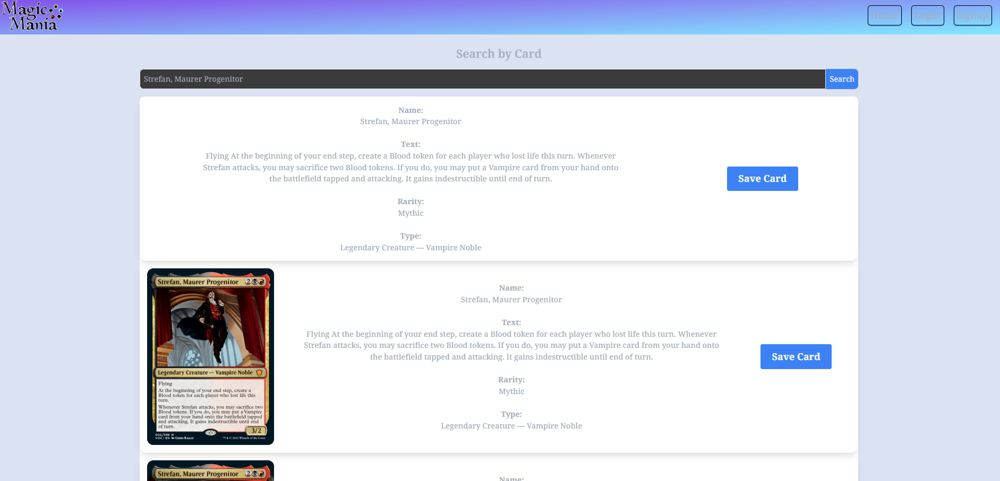
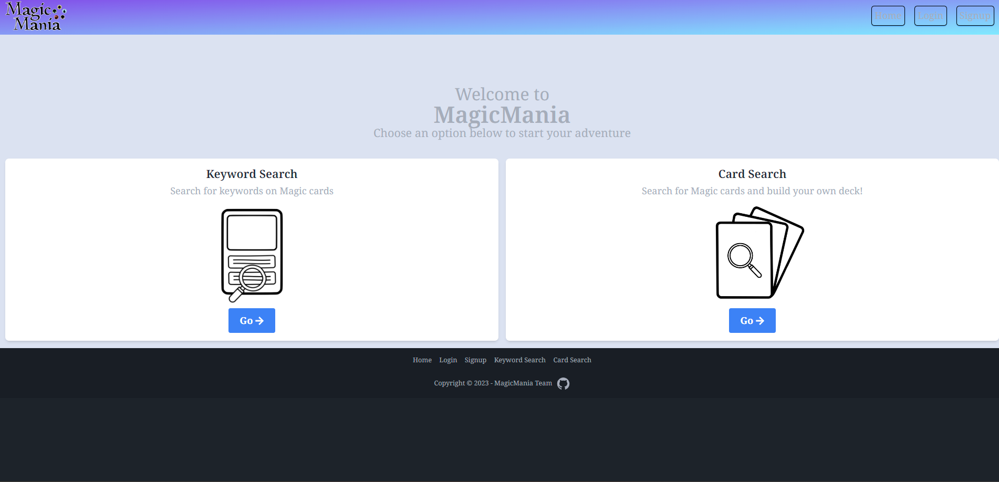
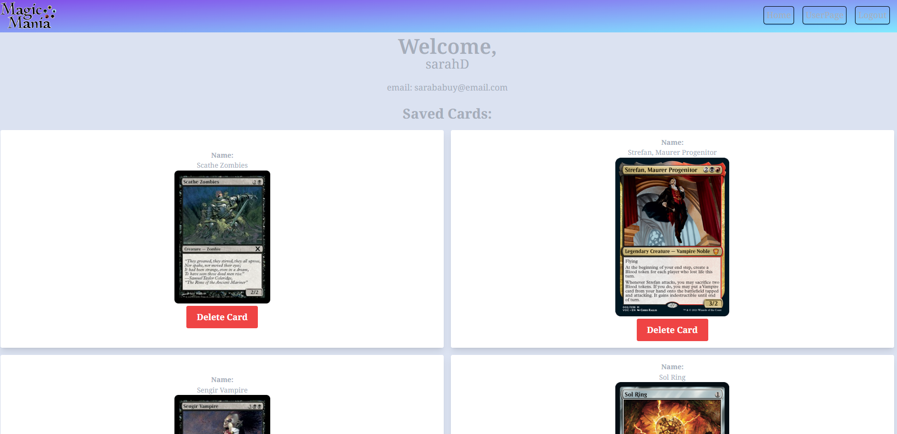

# Welcome to Magic Mania

## Table of Contents
- [About Magic Mania](#about)
 - [Installation](#installation)
 - [License](#license)
 - [Features](#featues)
 - [Contribution Guidelines](#contributing)
 - [Questons/Contact](#questions)

# About Magic Mania
Magic Mania is a web application dedicated to all things Magic: The Gathering. Whether you're a seasoned Planeswalker or a newcomer to the game, Magic Mania is your one-stop destination for all your MTG card needs.

## Installation
This project is also deployed on heroku, so no installation is necessary. Visit it [here](<insertHerokuLinkHERE>)

## License
This project does not currently have a license.

## Features
- Card Search
Explore the vast world of Magic cards with our powerful card search feature. Quickly find any card you desire, view it's details, and eve build your own decks!

- Keyword Search
Ever come across a perplexing keyword on a Magic card and wondered what it means(me, like everytime I play)? Magic Mania has you covered! Use our keyword search to unravel the mysteries of Magic keywords and finally destroy that one guy who always brings out his super OP dragon deck.

- User Accounts
Ever thinking of an experimental deck? Create your own account and personalize your Magic Mania experience by keep track of your favourite cards by building and saving decks. 

- Secure and User-friendly
Magic Mania values your security by using industry-standard encryption to protect user, email and password information. The password is salted like dried meat, and a JWT is used for autheticaiton. 

### Technologies used:
- React for front-end
- GraphQL with a Node.js and Express.js server
- MangoDB and Mongoose ODM for the database
- GraphQL queries and mutations for retrieving, adding, updating and deleting data.
- Authentication
- Bcrypt for password encryption
- JWT for added security
- Tailwind for styling

## Contribution Guidelines
This project was for educational purposes, if you'd sincerely want to contribute please read our [Contribution Guidelines](https://github.com/essence1987) to get started.

## Questions
For any questions, please contact one of contributors:

#### Camille Ramos
- GitHub: [camilleramos1](https://github.com/camilleramos1)

#### Holden Melander
- GitHub: [essence1987](https://github.com/essence1987)

#### MJ Thayne
- GitHub: [mayaj0yce](https://github.com/mayaj0yce)

#### Nate Kester
- GitHub: [imdawizard](https://github.com/imdawizard)

#### Mateo Lilo
- GitHub: [liloNStitch1975](https://github.com/liloNStitch1975)

## Deployed Application:
Visit the Project's source code on GitHub [here](https://github.com/mayaj0yce/magicMania)

Visit [Magic Mania](<insertHerokuLinkHERE>) on Heroku!

## ScreenShots

Disclaimer: Magic: The Gathering is a trademark of Wizards of the Coast LLC. Magic Mania is not affiliated with or endorsed by Wizards of the Coast.